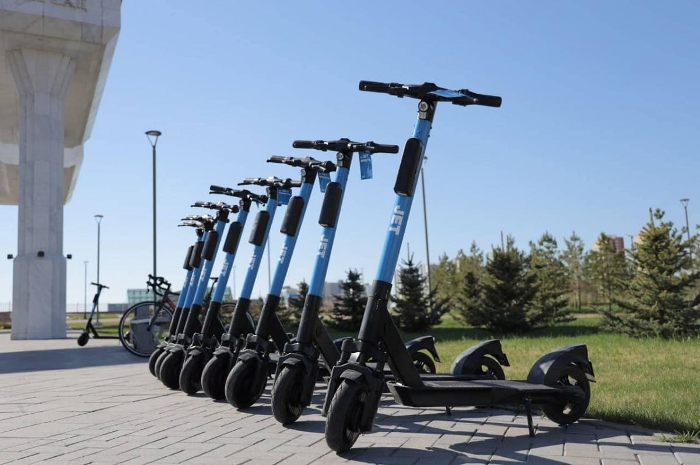

## Description :key:
A preliminary analysis of tariff usage on a sample of scooter service customers was carried out,
customer behavior when using the services was analyzed. Pre-processing
data, their analysis. Statistical hypotheses were tested on the basis of available data.

## Tasks :ballot_box_with_check:
The main goal of the project was to test three hypotheses:

1. User activity depends on the day of the week. Moreover, in Moscow and St. Petersburg it also differs.
2. On Monday mornings, certain genres prevail in Moscow, while others prevail in St. Petersburg. The same goes for Friday evenings, depending on the city.
3. People in Moscow and St. Petersburg prefer different genres: pop music is more popular in Moskow, in St. Petersburg - russian rap.

## Scope of activities :bulb:
Advertising platforms, Internet services, Internet shops, Digital-agencies / Marketing / PR / SEO, Startups, Tech-company, Business services [b2b]

## Used Libraries :mortar_board:
Pandas, Fuzzywuzzy, Seaborn, Matplotlib

## Tags :label:
Exploratory Data Analysis, Python, Pandas, Numpy, Matplotlib, Seaborn, Research, Data processing, Duplicates, Logical indexing, Grouping, Sorting, Levenshtein distance.

## Project Status :black_square_button:
_Completed_ 
